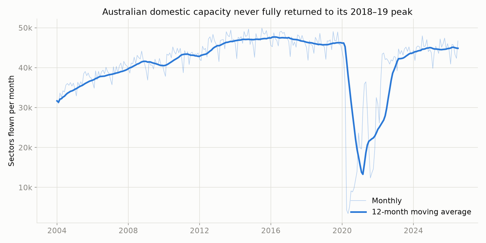
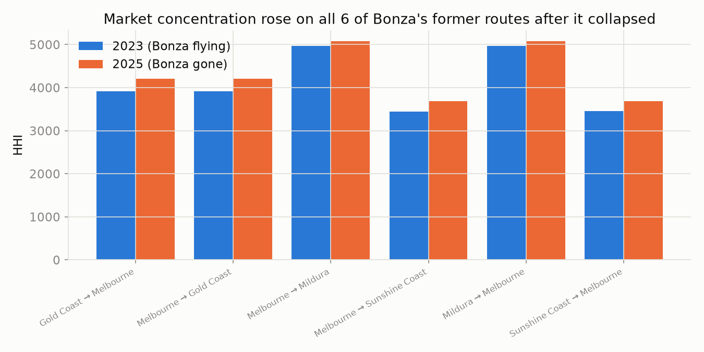
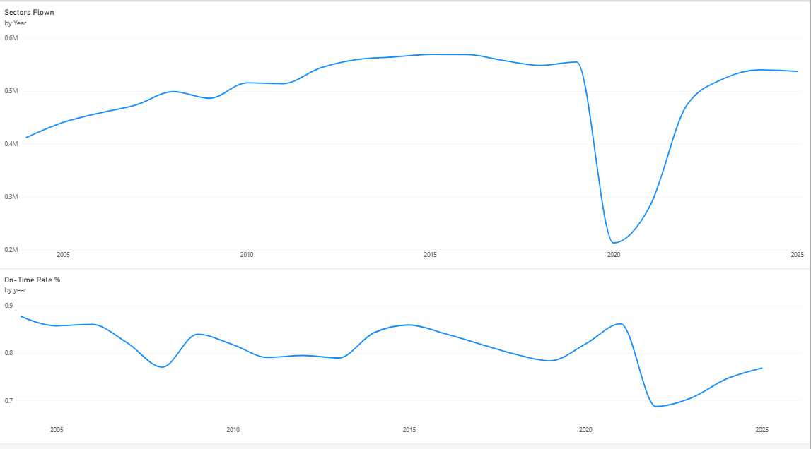
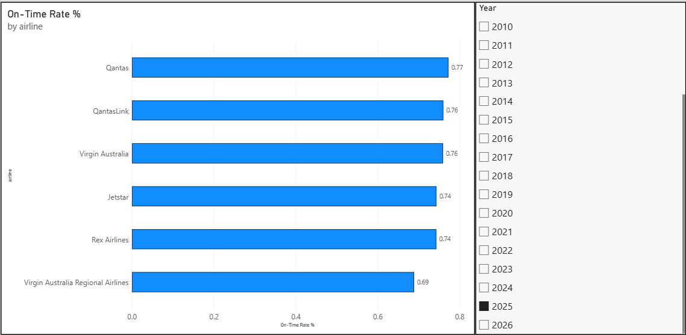
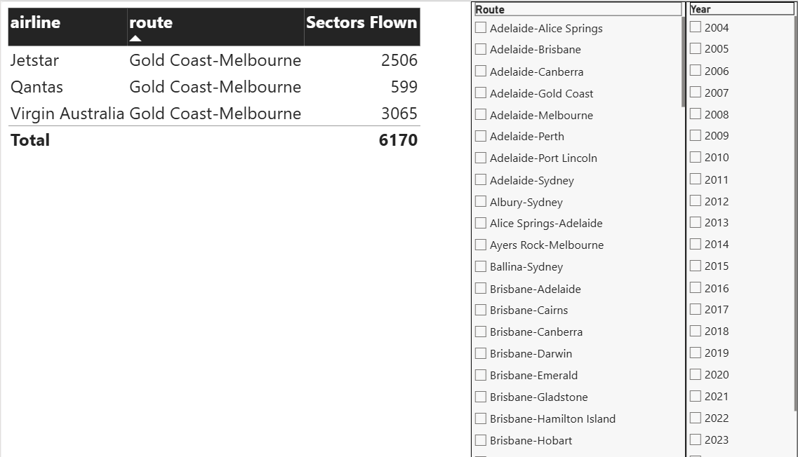

# Australian Domestic Airline Reliability & Market Recovery

**Which domestic airline actually gets you there on time, which routes never recovered from COVID, and did a budget carrier's 2024 collapse make its former routes less competitive?**

A cloud-and-SQL-first analysis of 22 years of Australian domestic flight data. The raw BITRE (Bureau of Infrastructure and Transport Research Economics) monthly on-time performance dataset is loaded into **Google BigQuery**, and every finding — joins, CTEs, `RANK()`, `LAG()`, `QUALIFY` window functions — comes from SQL running against it. A **Power BI dashboard connects live to the same BigQuery tables** for the interactive view; Python is used only to execute queries and chart results for this write-up.

---

## The Business Problem

Australia's domestic aviation market has been through more upheaval in the last six years than in the previous two decades combined: a total COVID shutdown, a chaotic 2022 reopening plagued by delays and staff shortages, and the 2024 collapse of budget carrier Bonza. Meanwhile the sector remains a live policy topic — regional connectivity, airline competition, and post-pandemic travel patterns are all regularly in the news.

**The business question:** using 22 years of real BITRE flight data (2004–2026), which airlines are actually the most reliable today, which routes still haven't recovered their pre-COVID capacity, and does losing a competing airline measurably concentrate a market?

## My Approach

1. **Stand up a cloud data warehouse.** Loaded the raw 119,038-row CSV into **Google BigQuery** via a staging → typed-schema ETL pattern (`sql/00`–`02`), standardising a handful of inconsistent airline-name spellings found during data-quality checks (`Macair`/`MacAir`, `virgin Australia`/`Virgin Australia`).
2. **Understand the data's rollup structure before analysing it.** BITRE includes its own "All Airlines" total row per route/month and an "All Ports-All Ports" nationwide total row — verified both are true sums of the underlying rows (not something to double-count), and flagged them (`is_all_airlines`, `is_national_total`) so every downstream query can choose the right grain deliberately.
3. **Answer 8 business questions entirely in SQL** (`sql/03_business_analysis.sql`) — national capacity trend, national reliability trend, airline reliability ranking, route-level COVID recovery (winners and losers), vanished routes, market concentration (HHI), and a Bonza-collapse case study — using CTEs, `RANK()`, `LAG()`, and analytic window functions with `QUALIFY`.
4. **Connect a live BI layer.** Power BI Desktop connects directly to the BigQuery tables (not a CSV export), so the dashboard reflects the same governed data as the SQL analysis.

## Key Findings

| Question | Finding |
|---|---|
| National capacity | Domestic flying peaked in 2018–19 (~47,500 sectors/month), collapsed to **13,300/month at the depth of COVID (2021)**, and by 2025 still sits **~5% below its pre-COVID peak** |
| National reliability | On-time performance fell for 4 straight years before COVID (86.1% → 77.5%), then **crashed to 67.4% in 2022** — an 18.7-point single-year drop as the network reopened faster than airlines could staff it — and has only partially recovered to 75.8% by 2025 |
| Airline reliability (2025) | **Qantas (77.3%)** narrowly leads Virgin Australia and QantasLink (both 76.0%) for on-time arrivals; **Virgin Australia Regional Airlines trails at 68.9%** |
| Post-COVID losers | Regional routes recovered worst — **Albury–Sydney sits at just 63% of its 2019 capacity**; Canberra–Melbourne, Gladstone–Brisbane and Port Lincoln–Adelaide all remain 20-25% below baseline |
| Post-COVID winners | Several leisure routes now fly **above** pre-COVID levels — **Adelaide–Canberra at 146%**, Brisbane–Hobart at 134% — a genuine domestic tourism boom, not just recovery |
| Vanished routes | **18 routes that had scheduled service in 2019 have none at all in 2025**, including Sydney–Darwin, Sydney–Townsville and Perth–Geraldton |
| Market concentration | Every one of the 15 most concentrated routes is a **two-carrier duopoly** (HHI > 5,200 — above the US antitrust "highly concentrated" threshold of 2,500); **no route-level monopolies exist** among routes with meaningful volume |
| Bonza case study | On all 6 routes Bonza used to fly, market concentration (HHI) **rose after its 2024 collapse**, even though total capacity on those routes barely changed — fewer competitors are now carrying essentially the same traffic |

## Why This Matters

The popular narrative is that Australian aviation "recovered" from COVID. The data says that's only half true: **national capacity still hasn't fully returned, reliability took years longer to recover than capacity did, and the recovery itself was deeply uneven** — regional Australia lost service some routes will likely never get back, while leisure corridors boomed. Layered on top, Bonza's exit shows that Australia's aviation market has very little competitive slack: losing even one low-cost entrant measurably concentrates the routes it served, with no sign another carrier stepped in to fill the gap.

## Business Recommendations

1. **Regional route decline deserves policy attention, not just market-recovery framing.** Routes like Albury–Sydney and the vanished Sydney–Darwin/Townsville services represent a durable reduction in regional connectivity, not a temporary COVID dip still working itself out.
2. **The 2022 reliability collapse is a staffing/operations story, not a demand story** — capacity had already substantially recovered by 2022, but on-time performance cratered anyway, pointing to workforce and operational readiness as the real constraint during reopening.
3. **Route-level competition is fragile.** With zero true monopolies but heavy duopoly concentration, the exit of a single low-cost carrier (as Bonza's did) is enough to raise concentration on the routes it served — a market structure worth watching as further budget-carrier consolidation risk.

## Limitations

- BITRE's on-time definitions (departure/arrival "on time" thresholds) are the regulator's own methodology, not independently re-derived here.
- "All Airlines" and "All Ports-All Ports" are used as verified rollups of the underlying rows, not recomputed from scratch — a genuine BITRE reporting error in those columns would carry through.
- 2026 is a partial year (7 months at the time of analysis) and excluded from all year-over-year comparisons to avoid a misleading partial-year figure.
- Market concentration (HHI) is computed on sectors flown as a capacity proxy, not on passenger volume, revenue, or seat count — a like-for-like measure across carriers, but not identical to how the ACCC would define a route's economic market.

## Interactive Dashboard (Power BI, live BigQuery connection)

`australian_airline_dashboard.pbix` connects directly to the `airline_ontime.flights_monthly` BigQuery table (Import mode) and lets a viewer filter by year and route interactively.

| National Trends | Airline Reliability (2025) |
|---|---|
|  |  |

**Route Explorer** — filtered here to one of Bonza's former routes (Gold Coast–Melbourne) in 2025: only 3 carriers remain, versus 6 when Bonza was still flying in 2023.

Full methodology, all 8 queries' results and the Power BI dashboard: **[executive_summary.md](executive_summary.md)**.

## Tools & Skills

`Google BigQuery` (cloud data warehouse, SQL analytics engine) · `SQL` (CTEs, `RANK()`, `LAG()`, `QUALIFY`, HHI market-concentration modelling) · `Power BI` (live BigQuery connection, DAX measures, interactive dashboard) · relational/typed-schema ETL (raw CSV → staging → typed table) · `Python` (pandas, matplotlib) for query execution and charting only · data-quality investigation (rollup-row verification, name-standardisation) · translating SQL output into a business narrative.

## Reproduction

The raw data (`otp_time_series_web.csv`, ~10MB) is not committed to this repo — download it from BITRE's public "Domestic airline on time performance time series" dataset on [data.gov.au](https://data.gov.au) and place it locally.

1. Create a Google Cloud project and enable the BigQuery API (the free sandbox tier — no billing account required — comfortably covers this dataset's size).
2. Run `sql/00_staging_schema.sql`, load the CSV into `airline_ontime.staging_otp` (all-STRING schema, header row skipped), then run `sql/01_schema.sql` and `sql/02_transform_load.sql` to build the typed `flights_monthly` table.
3. Run `sql/03_business_analysis.sql` directly in BigQuery, or execute `australian_airline_market_analysis.ipynb` end-to-end (`google-cloud-bigquery` + `db-dtypes` Python packages, authenticated via `gcloud auth application-default login`).
4. Connect Power BI Desktop to the same BigQuery project (Get Data → Google BigQuery) to reproduce the dashboard.

---

*Portfolio project — Master of Business Analytics, Kaplan Business School.*
